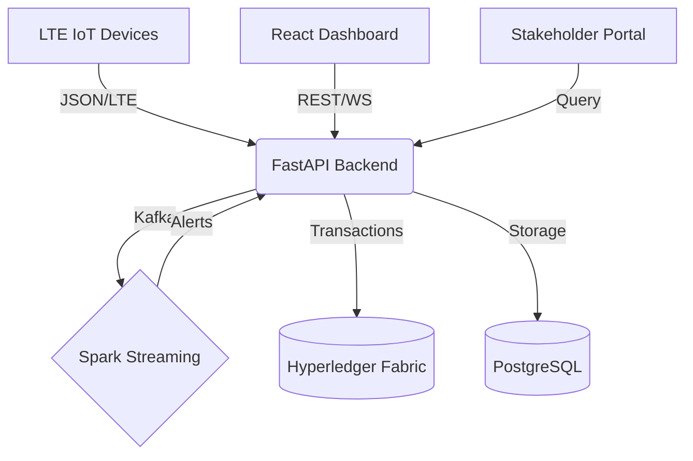

# ❄️ CryoTrace

### End-to-End Immutable Cold Chain Monitoring

---

## What is this?
CryoTrace is a decentralized supply chain monitoring platform designed to ensure the integrity of temperature-sensitive pharmaceutical shipments. It combines IoT telemetry, Big Data anomaly detection (Spark), and a tamper-evident blockchain ledger (Hyperledger Fabric) to provide a single source of truth for global cold chains.

## Why we built this?
- **Motivation**: Over 25% of vaccines reach their destination in a degraded state due to cold chain breaks. Current systems are siloed and prone to data manipulation.
- **Goals**: 
  - Real-time visibility into shipment conditions.
  - Automated "Chain-Break" alerts using Spark Streaming.
  - Immutable proof of custody for regulatory compliance.
  - Offline-first field operations for remote logistics hubs.

## Repository Structure
- `src/` — Core application code
  - `backend/` — FastAPI service with AI anomaly engine
  - `frontend/` — React-based operations dashboard
  - `streaming/` — Spark Structured Streaming & Device Simulator
  - `fabric-network/` — Hyperledger Fabric smart contracts & network config
  - `firmware/` — Arduino/LTE device firmware
- `challenges/` — Hackathon challenge tracking & sample inputs
- `datasets/` — Sample sensor logs & telemetry datasets
- `docs/` — Architecture diagrams & technical specifications
- `scripts/` — Helper scripts for setup, migration, and local runs
- `.github/` — CI/CD workflows & templates

## Key Links
- **Project Board / Scoreboard**: [SCOREBOARD.md](SCOREBOARD.md)
- **Contribution Guide**: [CONTRIBUTING.md](CONTRIBUTING.md)

## Architecture Diagram


## Dockerization
The entire stack is fully dockerized for easy evaluation.

### Quick Start
```bash
docker-compose up --build
```

### Services
- **Backend**: FastAPI (Port 8000)
- **Frontend**: React/Nginx (Port 3000)
- **Nginx Reverse Proxy**: Main Gateway (Port 80)
- **Spark Streaming**: Real-time anomaly detection
- **Postgres/Redis/Kafka**: Infrastructure layers
- **Simulator**: Automated device telemetry (run with `docker-compose --profile demo up`)
